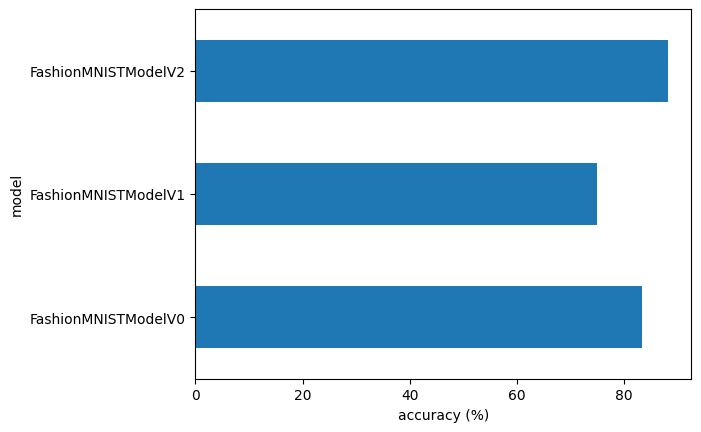
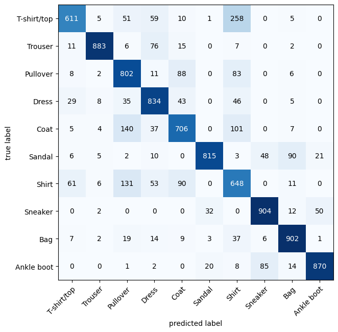
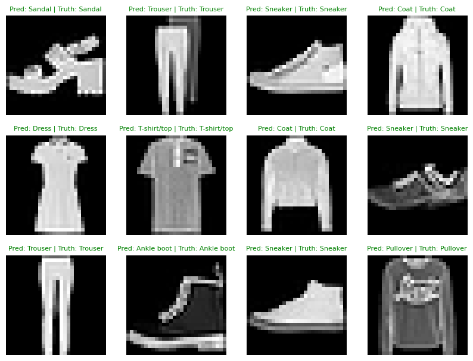
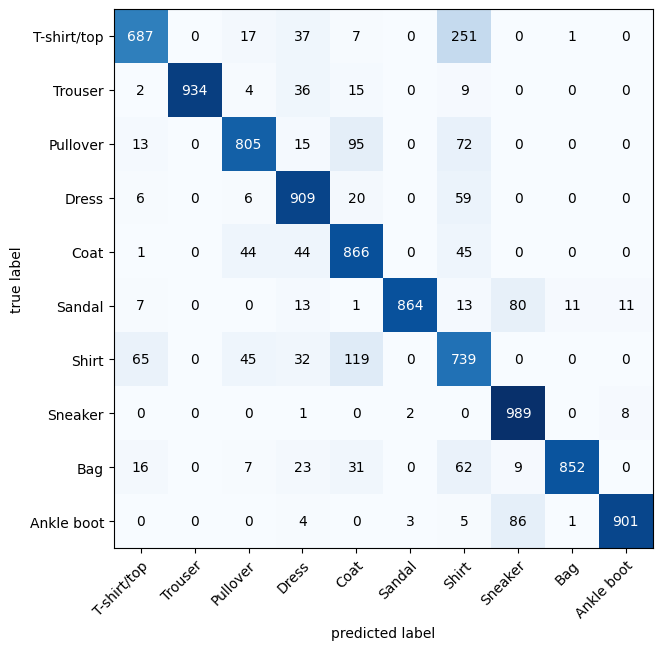

# Fashion Image Classification with PyTorch

A comprehensive deep learning project for fashion image classification using PyTorch and the FashionMNIST dataset. This project demonstrates the evolution from simple linear models to advanced convolutional neural networks with progressive improvements in accuracy.

## Project Overview

This project implements and compares multiple neural network architectures for classifying fashion images into 10 categories. The experiments progress from baseline models to advanced CNN architectures with batch normalization and dropout regularization.

**Dataset:** FashionMNIST  
**Classes:** 10 (T-shirt, Trouser, Pullover, Dress, Coat, Sandal, Shirt, Sneaker, Bag, Ankle boot)  
**Training Samples:** 60,000  
**Test Samples:** 10,000  
**Image Size:** 28×28 pixels (Grayscale)

---

## Notebooks

### 1. DL3_Computer Vision.ipynb

Demonstrates the progression from basic to advanced models:

- **Model 0 (Baseline Linear):** Simple linear layers without non-linearity in output
- **Model 1 (MLP with ReLU):** Multi-layer perceptron with ReLU activation
- **Model 2 (TinyVGG):** Convolutional Neural Network inspired by VGG architecture

### 2. VGGAdvanced.ipynb

Advanced CNN implementation with regularization techniques:

- **VGGAdvanced:** VGG-inspired architecture with batch normalization and dropout

---

## Experiments & Results

### Accuracy Comparison

| Model                     | Architecture                  | Accuracy   | Loss      | Precision | Recall    | F1-Score  |
| ------------------------- | ----------------------------- | ---------- | --------- | --------- | --------- | --------- |
| Model 0 (Baseline Linear) | 2-Layer FC                    | 83.43%     | 0.4766    | 0.8341    | 0.8341    | 0.8341    |
| Model 1 (MLP with ReLU)   | 3-Layer FC + ReLU             | 75.02%     | 0.6850    | 0.75      | 0.75      | 0.75      |
| Model 2 (TinyVGG)         | CNN                           | 88.21%     | 0.3226    | 0.8820    | 0.8820    | 0.8820    |
| **VGGAdvanced**           | **CNN + BatchNorm + Dropout** | **89.73%** | **0.285** | **0.897** | **0.897** | **0.897** |

### Key Findings

1. **Best Model:** VGGAdvanced achieved the highest accuracy of **89.73%**
2. **CNN Superiority:** Convolutional layers (Model 2: 88.21%, VGGAdvanced: 89.73%) significantly outperform fully connected layers
3. **Regularization Impact:** Batch normalization and dropout in VGGAdvanced improved accuracy by **1.52%** compared to TinyVGG
4. **Loss Reduction:** Loss decreased from 0.4766 (Baseline) to 0.285 (VGGAdvanced), showing improved model confidence

---

## Visualization Results

### Models Comparison


_Comparison of accuracy across all 3 models - showing clear superiority of CNN-based architectures_

### Confusion Matrices

#### Model 0 (Baseline Linear)


_Predicting on some images using the model 2_

#### All Models Combined


_Detailed confusion matrices for Model 2 of the DL3 Computer Vision Notebook_

#### VGGAdvanced Model


_Predicting on some images using the best model_

#### VGGAdvanced Detailed Results


_Confusion matrix for the best-performing VGGAdvanced model with 89.73% accuracy_

---

## Model Architectures

### Model 0: Baseline Linear (83.43% Accuracy)

```
- Flatten: 784 inputs
- Linear: 784 → 128
- ReLU
- Linear: 128 → 10 (no activation)
```

### Model 1: MLP with ReLU (75.02% Accuracy)

```
- Flatten: 784 inputs
- Linear: 784 → 10
- ReLU
- Linear: 10 → 10
```

### Model 2: TinyVGG (88.21% Accuracy)

```
- Conv Block 1: 1→10 channels (3×3 kernel)
  - 2 Conv layers + MaxPool
- Conv Block 2: 10→10 channels (3×3 kernel)
  - 2 Conv layers + MaxPool
- Classifier: Flatten → FC(3136→10)
```

### VGGAdvanced: VGG with Regularization (89.73% Accuracy)

```
- Block 1: 1→32 channels (3×3 kernel)
  - Conv + BatchNorm + ReLU
  - Conv + BatchNorm + ReLU
  - MaxPool
- Block 2: 32→64 channels (3×3 kernel)
  - Conv + BatchNorm + ReLU
  - MaxPool
- Classifier:
  - Flatten
  - Dropout(0.3)
  - FC(3136→10)
```

---

## Training Configuration

### Common Hyperparameters

- **Loss Function:** CrossEntropyLoss
- **Optimizer:** Stochastic Gradient Descent (SGD)
- **Learning Rate:** 0.1

### DL3_Computer Vision Models

- **Batch Size:** 32
- **Epochs:** 3
- **Device:** GPU

### VGGAdvanced Model

- **Batch Size:** 64
- **Epochs:** 5
- **Device:** GPU
- **Regularization:** Batch Normalization + Dropout(0.3)

---

## Performance Metrics

### Best Model Results (VGGAdvanced)

- **Test Accuracy:** 89.73%
- **Test Loss:** 0.285
- **Precision:** 0.897
- **Recall:** 0.897
- **F1-Score:** 0.897

### Accuracy Improvement

- **Baseline → VGGAdvanced:** +6.3% (from 83.43% to 89.73%)
- **TinyVGG → VGGAdvanced:** +1.52% (from 88.21% to 89.73%)

---

## Key Techniques

1. **Convolutional Layers:** Extract spatial features from images
2. **Max Pooling:** Reduce dimensionality while preserving important features
3. **Batch Normalization:** Stabilize training and enable higher learning rates
4. **Dropout:** Prevent overfitting and improve generalization
5. **Data Augmentation:** ToTensor() transformation for PyTorch compatibility

---

## Requirements

```
torch
torchvision
matplotlib
pandas
numpy
tqdm
mlxtend (for confusion matrix visualization)
torchmetrics (for precision, recall, F1-score)
```

---

## Conclusion

This project demonstrates the effectiveness of convolutional neural networks for image classification tasks. The progression from basic models (83.43% accuracy) to advanced architectures (89.73% accuracy) shows the impact of:

1. **Architecture Complexity:** CNNs > MLPs > Linear Models
2. **Regularization:** Batch normalization and dropout improve generalization
3. **Training Time:** More epochs and larger batch sizes aid convergence
4. **Feature Extraction:** Convolutional layers automatically learn meaningful features

The VGGAdvanced model successfully classifies fashion images with over 89% accuracy, making it suitable for practical applications in fashion recommendation and automated clothing categorization systems.

This is a training project for Machine Learning foundations. It demonstrates practical implementation of neural networks using PyTorch, progressive model improvement through architectural changes, and evaluation using multiple metrics beyond accuracy.

## Author

- Developed by: Omar Hafez Khalil
- GitHub: [OmarHKhalil](https://github.com/OmarHKhalil)
- LinkedIn: [Omar Khalil](https://www.linkedin.com/in/omar-khalil-55a674281)
