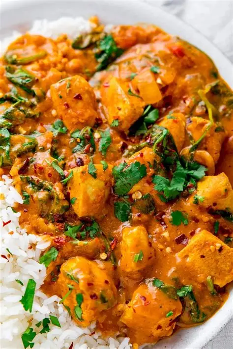
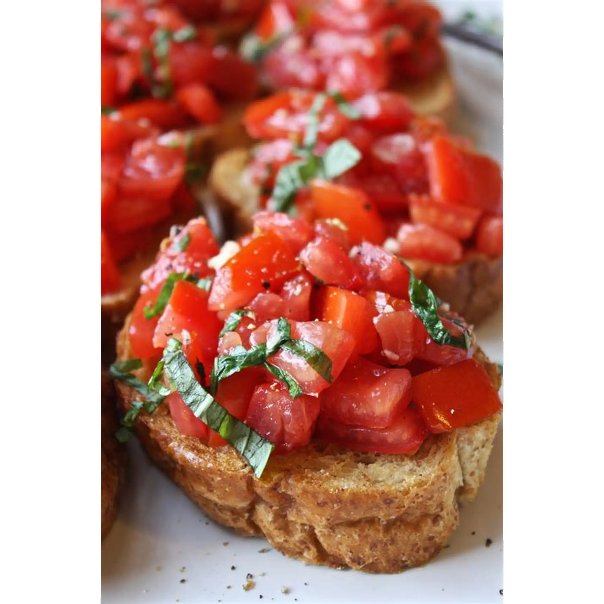

# NutriVision: Food Classification with Deep Learning

## Project Overview

**NutriVision** is a deep learning project focused on classifying food images into 30 different food categories using various state-of-the-art convolutional neural network architectures. This project is part of a Modern Machine Learning (MML) training program and demonstrates the practical application of transfer learning and custom CNN architectures for food image classification.

The project compares three different approaches:

- **Transfer Learning with Pre-trained Models**: ResNet50 and EfficientNet-B0
- **Custom CNN Architecture**: A custom-built Advanced Food CNN trained from scratch

### Dataset

The project uses the **Food-101 dataset**, specifically the first 30 food categories:

- apple_pie, baby_back_ribs, baklava, beef_carpaccio, beef_tartare, beet_salad, beignets, bibimbap, bread_pudding, breakfast_burrito, bruschetta, caesar_salad, cannoli, caprese_salad, carrot_cake, ceviche, cheesecake, cheese_plate, chicken_curry, chicken_quesadilla, chicken_wings, chocolate_cake, chocolate_mousse, churros, clam_chowder, club_sandwich, crab_cakes, creme_brulee, croque_madame, cup_cakes

- **Training Samples**: 22500 images
- **Test Samples**: 7500 images
- **Batch Size**: 16
- **Image Input Size**: 224x224 or 512x512 (varies by model)

---

## Project Architecture

### 1. Data Pipeline

- **Dataset Class**: Custom `Food101Dataset` class for efficient data loading
- **Data Augmentation**: Applied `TrivialAugmentWide` with 31 magnitude bins for robust training
- **Normalization**: ImageNet normalization (mean=[0.485, 0.456, 0.406], std=[0.229, 0.224, 0.225])
- **Transformations**:
  - Training: Resize → TrivialAugmentWide → ToTensor → Normalize
  - Testing: Resize → ToTensor → Normalize

### 2. Models Trained

#### Model 1: EfficientNet-B0 (224x224)

- **Architecture**: Transfer learning with pre-trained EfficientNet-B0
- **Input Size**: 224x224 pixels
- **Frozen Layers**: All backbone layers frozen, only final classifier layer trained
- **Classifier**: Dropout(0.2) → Linear(1280 → 30 classes)
- **Training Details**: 25 epochs, Adam optimizer (lr=0.001), Cross-Entropy Loss

#### Model 2: ResNet50 (512x512)

- **Architecture**: Transfer learning with pre-trained ResNet50
- **Input Size**: 512x512 pixels
- **Frozen Layers**: All backbone layers frozen, only final FC layer trained
- **Classifier**: Dropout(0.3) → Linear(2048 → 30 classes)
- **Training Details**: 25 epochs, Adam optimizer (lr=0.001), Cross-Entropy Loss

#### Model 3: EfficientNet-B0 (512x512)

- **Architecture**: Transfer learning with pre-trained EfficientNet-B0
- **Input Size**: 512x512 pixels
- **Frozen Layers**: All backbone layers frozen, only final classifier layer trained
- **Classifier**: Dropout(0.2) → Linear(1280 → 30 classes)
- **Training Details**: 25 epochs, Adam optimizer (lr=0.001), Cross-Entropy Loss

#### Model 4: AdvancedFoodCNN (Custom CNN)

- **Architecture**: Custom CNN built from scratch with batch normalization
- **Input Size**: 224x224 pixels
- **Layers**:
  - Conv Block 1: Conv2d(3→32) + Conv2d(32→64) + BatchNorm + ReLU + MaxPool
  - Conv Block 2: Conv2d(64→128) + Conv2d(128→128) + BatchNorm + ReLU + MaxPool
  - Conv Block 3: Conv2d(128→256) + BatchNorm + ReLU + MaxPool
  - Adaptive Global Average Pooling
  - Classifier: Flatten → Linear(256*7*7→256) → ReLU → Dropout(0.1) → Linear(256→30 classes)
- **Training Details**: 100 epochs total (4 runs of 25 epochs), Adam optimizer (lr=0.0001), Cross-Entropy Loss
- **Early Stopping**: Patience=5 with min_delta=0.005

---

## Model Evaluation Metrics

The following metrics were used to evaluate all models:

- **Accuracy**: Percentage of correct predictions
- **Precision**: True Positives / (True Positives + False Positives)
- **Recall**: True Positives / (True Positives + False Negatives)
- **F1-Score**: Harmonic mean of Precision and Recall
- **Loss**: Cross-Entropy Loss

All metrics were computed for both training and test sets.

---

## Experimental Results

### Model Comparison Table

| **Model**           | **Input Size** | **Set**               | **Loss** | **Accuracy** | **Precision** | **Recall** | **F1-Score** |
| ------------------- | -------------- | --------------------- | -------- | ------------ | ------------- | ---------- | ------------ |
| **EfficientNet-B0** | 224x224        | Train                 | 1.1694   | 66.86%       | 0.6696        | 0.6682     | 0.6667       |
| **EfficientNet-B0** | 224x224        | Test                  | 1.0147   | **70.69%**   | 0.7074        | 0.7061     | 0.7036       |
| **ResNet50**        | 512x512        | Train                 | 0.7658   | **78.36%**   | **0.7861**    | **0.7836** | **0.7827**   |
| **ResNet50**        | 512x512        | Test                  | 0.7182   | **79.18%**   | **0.7911**    | **0.7915** | **0.7892**   |
| **EfficientNet-B0** | 512x512        | Train                 | 0.9242   | 73.14%       | 0.7350        | 0.7314     | 0.7302       |
| **EfficientNet-B0** | 512x512        | Test                  | 0.7654   | 77.41%       | 0.7764        | 0.7735     | 0.7717       |
| **AdvancedFoodCNN** | 224x224        | Train (Epochs 1-25)   | 2.2666   | 34.82%       | 0.3483        | 0.3483     | 0.3316       |
| **AdvancedFoodCNN** | 224x224        | Test (Epochs 1-25)    | 2.1043   | 38.73%       | 0.3653        | 0.3873     | 0.3615       |
| **AdvancedFoodCNN** | 224x224        | Train (Epochs 26-50)  | 1.7221   | 49.81%       | 0.5032        | 0.4981     | 0.4919       |
| **AdvancedFoodCNN** | 224x224        | Test (Epochs 26-50)   | 1.7818   | 47.44%       | 0.4702        | 0.4745     | 0.4649       |
| **AdvancedFoodCNN** | 224x224        | Train (Epochs 51-75)  | 1.4074   | 59.38%       | 0.5906        | 0.5939     | 0.5888       |
| **AdvancedFoodCNN** | 224x224        | Test (Epochs 51-75)   | 1.7218   | 49.93%       | 0.4927        | 0.4995     | 0.4922       |
| **AdvancedFoodCNN** | 224x224        | Train (Epochs 76-100) | 1.2840   | 63.21%       | 0.6287        | 0.6319     | 0.6272       |
| **AdvancedFoodCNN** | 224x224        | Test (Epochs 76-100)  | 1.7525   | 50.16%       | 0.4952        | 0.5016     | 0.4951       |

### Key Findings

#### Best Overall Performance: **ResNet50 (512x512)**

- **Test Accuracy**: 79.18%
- **Test F1-Score**: 0.7892
- **Advantages**:
  - Highest accuracy on test set among transfer learning models
  - Strong generalization with low overfitting
  - Excellent precision and recall balance

#### Transfer Learning Comparison

- **ResNet50 (512x512)** achieves the best performance with 79.18% accuracy
- **EfficientNet-B0 (512x512)** follows with 77.41% accuracy
- **EfficientNet-B0 (224x224)** reaches 70.69% accuracy with smaller input size
- Larger input size (512x512) consistently improves performance over smaller inputs

#### Custom CNN from Scratch

- **Progressive Improvement**: The AdvancedFoodCNN shows steady improvement across 100 epochs (4 runs of 25 epochs each)
- **Training Progression**:
  - Epochs 1-25: 38.73% test accuracy (initialization phase)
  - Epochs 26-50: 47.44% test accuracy (gradual learning)
  - Epochs 51-75: 49.93% test accuracy (plateau begins)
  - Epochs 76-100: 50.16% test accuracy (overfitting evident)
- **Overfitting Issue**: Significant gap between training and test performance indicates overfitting as epochs increase
- **Final Test Accuracy**: 50.16% (significantly lower than transfer learning models)

#### Performance Insights

1. **Transfer Learning Dominance**: Pre-trained models vastly outperform custom CNN, even with limited training data
2. **Input Size Impact**: 512x512 inputs improve accuracy by 6-10% compared to 224x224
3. **ResNet50 Superiority**: ResNet50 outperforms EfficientNet-B0 by 1.8% on this specific task
4. **Overfitting Challenge**: Custom CNN struggles with overfitting, suggesting the need for stronger regularization or data augmentation

---

## Sample Predictions

The models were tested on real-world food images:

### Test Image 1: Chocolate Cake


**Model Predictions**:

- ResNet50 (512x512): ✓ Correctly identified as Chocolate Cake
- AdvancedFoodCNN: ✓ Successfully classified

### Test Image 2: Chicken Curry



**Model Predictions**:

- ResNet50 (512x512): ✓ Correctly identified as Chicken Curry
- AdvancedFoodCNN: wrong classification

### Test Image 3: Bruschetta



**Model Predictions**:

- ResNet50 (512x512): ✓ Correctly identified as Bruschetta
- AdvancedFoodCNN: wrong classification

---

## Project Structure

```
NutriVision-Food-Classification/
├── NutriVision.ipynb          # Main Jupyter notebook with full implementation
├── Models/                    # Directory containing trained model weights
│   ├── AdvancedFoodCNN.pth    # Custom CNN model weights
│   ├── model_efficien.pth     # EfficientNet-B0 (512x512) weights
│   └── model_resnet.pth       # ResNet50 (512x512) weights
├── runs/                      # TensorBoard logs and training run directories
│   ├── AdvancedFoodCNN/
│   ├── EfficientNet_FineTuning/
│   └── ResNet50_FineTuning/
├── Test Image/                # Sample images for model testing
│   ├── chocolate_cake.jpg
│   ├── chicken_curry.webp
│   └── bruschetta.webp
├── images/                    # Reference images for documentation
│   └── [copies of test images]
└── README.md                  # This file
```

---

## Runs (TensorBoard logs)

The `runs/` directory contains TensorBoard event logs produced during training. Each experiment creates a subfolder and one or more timestamped run folders or event files. These logs include scalars (loss, accuracy, F1), and can be opened with TensorBoard for interactive inspection.

Current `runs/` contents in this repository:

- `runs/AdvancedFoodCNN/` — multiple timestamped runs:
  - `2026-06-17_22-09-38/`
  - `2026-06-18_02-47-52/`
  - `2026-06-18_07-04-02/`
  - `2026-06-18_12-00-23/`
- `runs/EfficientNet_FineTuning/` — experiment folders for EfficientNet variants:
  - `EfficientNet-B0_224/` (contains `events.out.tfevents.*`)
  - `EfficientNet-B0_512/` (contains `events.out.tfevents.*`)
- `runs/ResNet50_FineTuning/` — timestamped run:
  - `2026-06-17_01-59-59/` (contains `events.out.tfevents.*`)

How to view logs with TensorBoard:

```bash
# from the project root
tensorboard --logdir runs --port 6006
# then open http://localhost:6006 in your browser
```

## Implementation Details

### Libraries and Dependencies

- **PyTorch**: Deep learning framework
- **TorchVision**: Computer vision utilities
- **TorchMetrics**: Model evaluation metrics
- **Pillow (PIL)**: Image processing
- **TensorBoard**: Training visualization
- **NumPy**: Numerical computations

### Training Configuration

- **Loss Function**: Cross-Entropy Loss
- **Optimizer**: Adam
- **Learning Rate**: 0.001 (transfer learning), 0.0001 (custom CNN)
- **Batch Size**: 16
- **Device**: GPU (CUDA) if available, CPU fallback
- **Scheduler**: StepLR with step_size=2, gamma=0.5 (on some models)

### Data Transformations

```python
# For 512x512 models (ResNet50, EfficientNet-512)
train_transforms = Compose([
    Resize((512, 512)),
    TrivialAugmentWide(num_magnitude_bins=31),
    ToTensor(),
    Normalize(mean=[0.485, 0.456, 0.406], std=[0.229, 0.224, 0.225])
])

# For 224x224 models (AdvancedFoodCNN, EfficientNet-224)
train_transforms = Compose([
    Resize((224, 224)),
    TrivialAugmentWide(num_magnitude_bins=31),
    ToTensor(),
    Normalize(mean=[0.485, 0.456, 0.406], std=[0.229, 0.224, 0.225])
])
```

---

## How to Use

### 1. Setup Environment

```bash
pip install torch torchvision torchmetrics pillow tensorboard
```

### 2. Prepare Data

- Download the Food-101 dataset from: https://www.kaggle.com/datasets/dansbechter/food-101
- Place it in the project directory as `food-101/`

### 3. Run the Notebook

```bash
jupyter notebook NutriVision.ipynb
```

### 4. Train Models

Execute cells in order:

1. Setup and data loading
2. Model initialization
3. Training loops
4. Evaluation

### 5. Make Predictions

```python
# Load model and make prediction
Prediction(model, transform, "path/to/image.jpg")
```

---

## Future Improvements

1. **Fine-tuning**: Unfreeze some layers of pre-trained models for better adaptation
2. **Advanced Augmentation**: Experiment with more sophisticated augmentation techniques
3. **Hyperparameter Optimization**: Use grid search or Bayesian optimization for tuning
4. **Data Collection**: Expand dataset with more food categories
5. **Model Distillation**: Create lightweight models for deployment

---

## Performance Benchmark Summary

| Metric                | Best Model         | Score  |
| --------------------- | ------------------ | ------ |
| Highest Test Accuracy | ResNet50 (512x512) | 79.18% |
| Best F1-Score         | ResNet50 (512x512) | 0.7892 |
| Highest Precision     | ResNet50 (512x512) | 0.7911 |
| Highest Recall        | ResNet50 (512x512) | 0.7915 |
| Lowest Test Loss      | ResNet50 (512x512) | 0.7182 |

---

## License

This project is for educational purposes as part of the Modern Machine Learning (MML) training program.

---

## Author

_Out of the 101 categories available in the Food-101 dataset, a subset of 30 classes was selected to train a custom CNN architecture from scratch. This reduction to 30 categories was strictly due to hardware and computational resource._

- Developed by: Omar Hafez Khalil
- GitHub: [OmarHKhalil](https://github.com/OmarHKhalil)
- LinkedIn: [Omar Khalil](https://www.linkedin.com/in/omar-khalil-55a674281)
