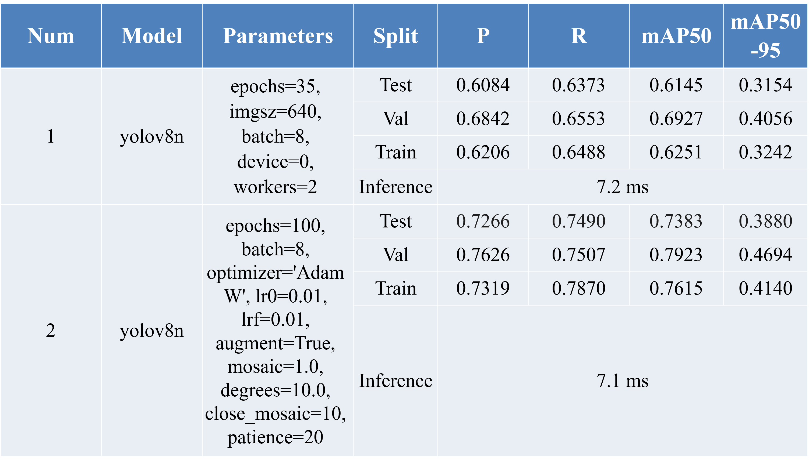
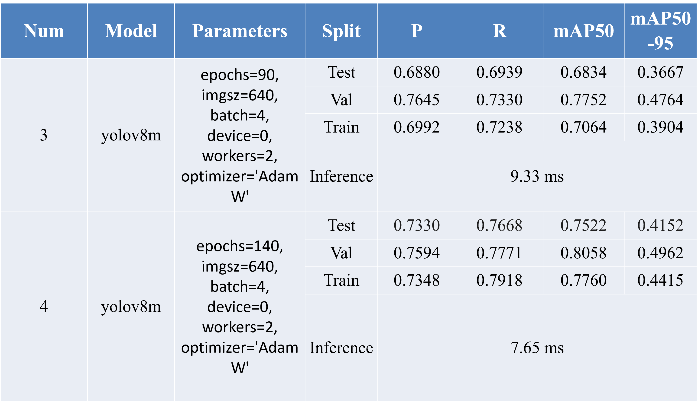
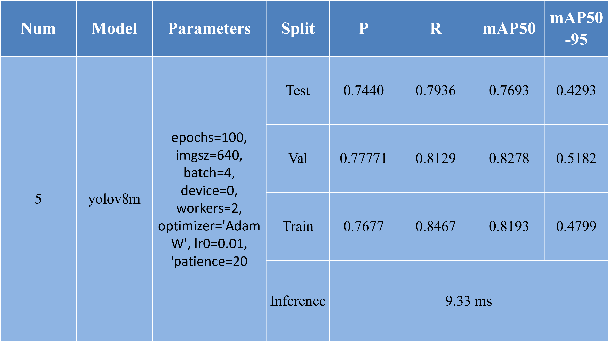
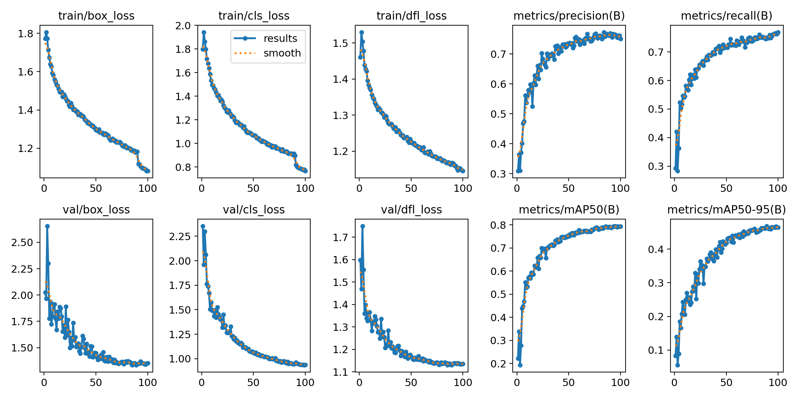
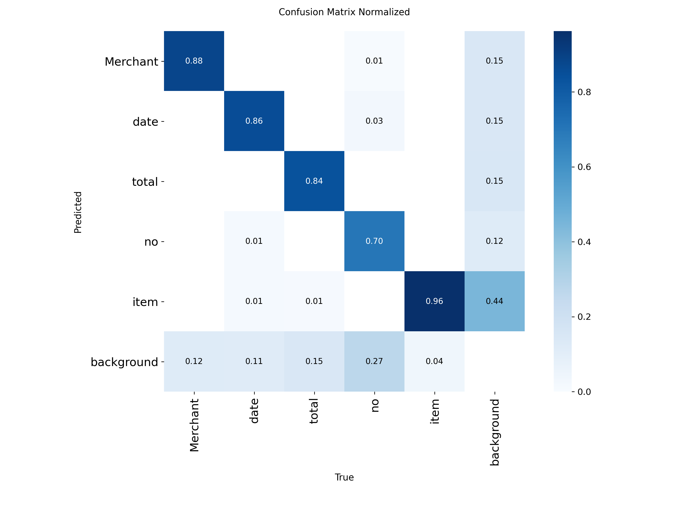
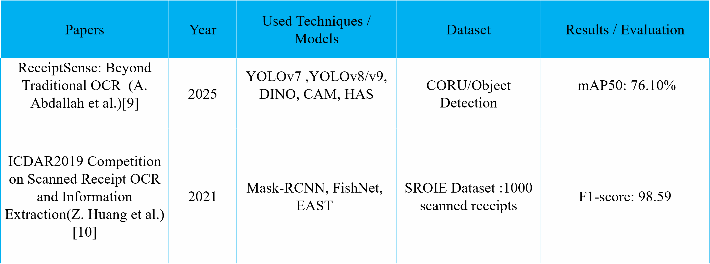
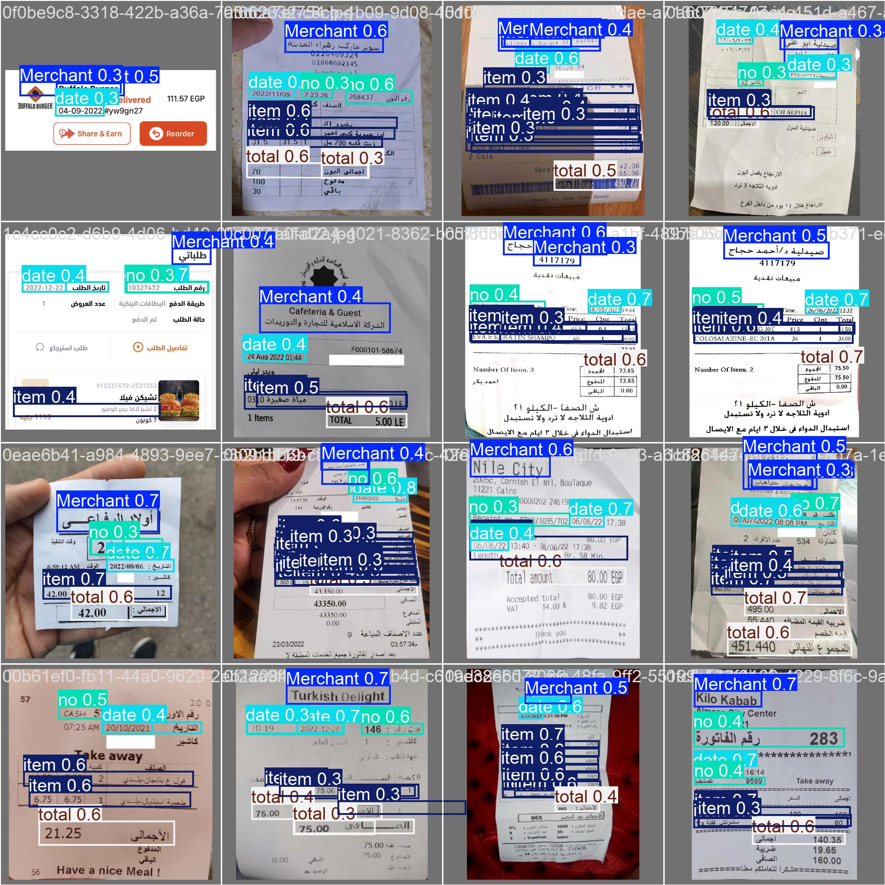
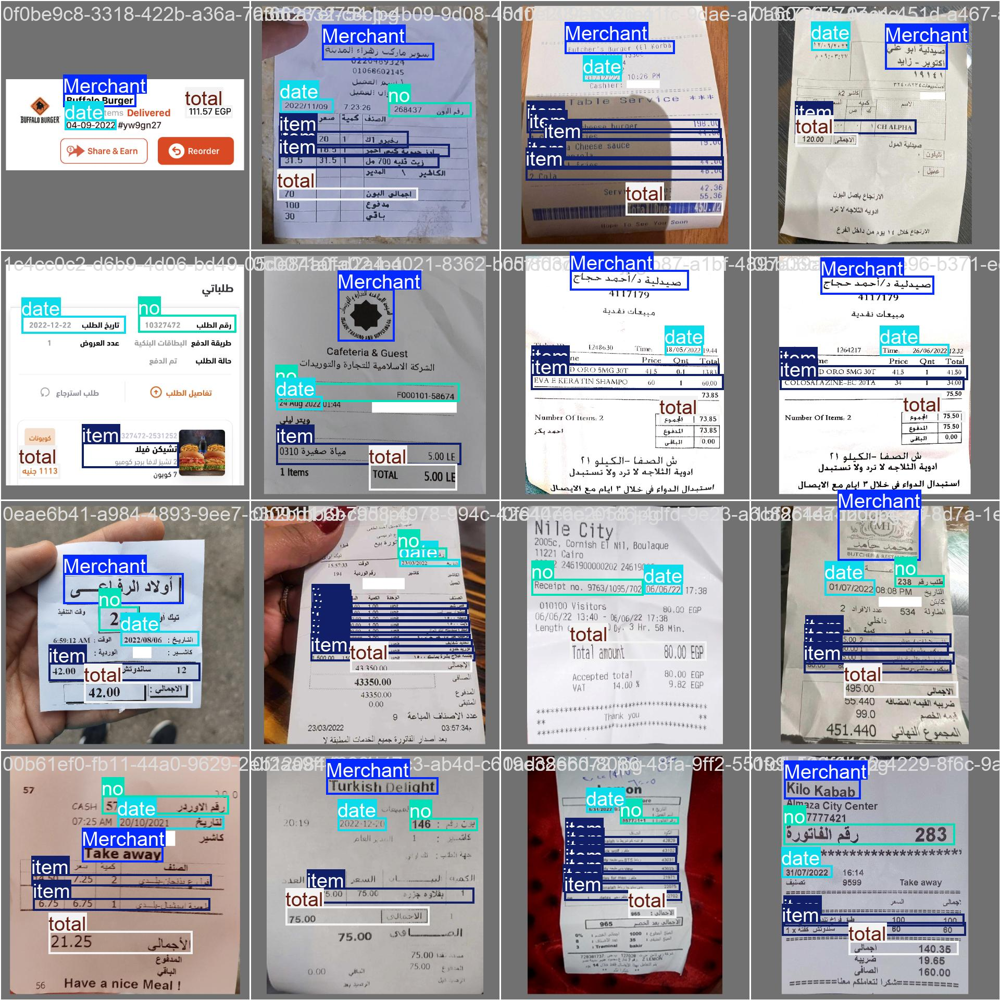

**Receipt Component Spatial Localization**

- **Project**: Receipt component detection and bounding-box prediction using YOLOv8.
- **Goal**: Detect and segment high-value regions (Total Amount, Item List, Date, Invoice Number, Store Name) from receipt images for focused OCR.

**Concept & System Architecture**

- **Idea**: This module performs spatial localization on receipt images to identify and crop only the most important regions (Total Amount, Item List, Date, Invoice Number, Store Name). Crops are then passed to an OCR engine to improve text-recognition accuracy and reduce noise from irrelevant areas. The detection stage uses YOLOv8 to predict bounding boxes for each class; post-processing filters, sorts, and crops predictions for downstream OCR.
- System architecture for receipt component detection and bounding box prediction using YOLO.
  
  **Dataset & Preprocessing**
- **Source**: ReceiptSense dataset (8,439 annotated images, ~12 GB).
- **Profile**: Dataset profile defined in `data.yaml` with class labels and paths.
- **Standardization**: All images were resized to 640 × 640 for model input consistency.
- **Splits**: 6,024 train / 1,615 test / 800 validation.
- **Augmentation**: Mosaic, RandomRotation (degrees up to 10), and advanced augmentation policies used during training.

**Models & Experiments**

- **Backbone**: YOLOv8 family (nano `yolov8n`, medium `yolov8m`).
- **Experiment highlights**:
  - **Exp 1**: YOLOv8n baseline (100 epochs) — baseline mAP50 improvements across training.
  - **Exp 2**: YOLOv8n fine-tuned (AdamW, lr0=0.01, patience=20, mosaic=1.0, degrees=10.0, close_mosaic=10).
  - **Exp 3–5**: YOLOv8m (progressively fine-tuned and persisted weights). Best configuration (Exp 5) reached validation mAP50 ~ 0.8278 and test mAP50 ~ 0.7693.

**Results & Visuals**

- Precision-Recall, confusion matrices, and training curves are available in `runs/`.

Embedded examples:

**Representative invoice with detected boxes**

The following images show model predictions vs. ground-truth labels on a validation batch (useful for qualitative inspection):

**Where to find artifacts**

- Training outputs, plots, validation visualizations, and checkpoints are under the `runs/` folder (examples referenced above). Notable checkpoint: `runs/detect/yolov8m_32/weights/best.pt`.

**Experiment Details (per-epoch snapshots)**

Experiment 1 — YOLOv8-Nano (selected epochs)

| Epoch | Train/Box | Train/Cls | Train/Dfl | Val/Box | Val/Cls | Val/Dfl | mAP50(B) | mAP50-95 |
| ----: | --------: | --------: | --------: | ------: | ------: | ------: | -------: | -------: |
|     1 |     2.274 |     3.005 |     1.652 |   1.797 |   2.365 |   1.354 |    0.205 |    0.091 |
|    10 |     1.592 |     1.610 |     1.249 |   1.521 |   1.563 |   1.267 |    0.493 |    0.259 |
|    20 |     1.515 |     1.396 |     1.204 |   1.411 |   1.293 |   1.196 |    0.626 |    0.351 |
|    30 |     1.459 |     1.285 |     1.171 |   1.376 |   1.214 |   1.171 |    0.664 |    0.384 |
|    35 |     1.431 |     1.215 |     1.148 |   1.355 |   1.167 |   1.156 |    0.693 |    0.405 |

Experiment 2 — Fine-tuning (YOLOv8-Medium, selected epochs)

| Epoch | Train/Box | Train/Cls | Train/Dfl | Val/Box | Val/Cls | Val/Dfl | mAP50(B) | mAP50-95 |
| ----: | --------: | --------: | --------: | ------: | ------: | ------: | -------: | -------: |
|     1 |      1.77 |      1.80 |      1.46 |    2.02 |    2.35 |    1.60 |     0.22 |     0.08 |
|    20 |      1.47 |      1.35 |      1.32 |    1.60 |    1.32 |    1.25 |     0.66 |     0.33 |
|    40 |      1.35 |      1.13 |      1.24 |    1.45 |    1.12 |    1.17 |     0.72 |     0.40 |
|    60 |      1.27 |      1.02 |      1.20 |    1.41 |    1.02 |    1.15 |     0.78 |     0.44 |
|    80 |      1.20 |      0.93 |      1.17 |    1.36 |    0.97 |    1.14 |     0.78 |     0.45 |
|   100 |      1.08 |      0.77 |      1.15 |    1.35 |    0.94 |    1.14 |     0.79 |     0.46 |

Experiment 3 — YOLOv8m (selected epochs)

| Epoch | Train/Box | Train/Cls | Val/Box | Val/Cls | mAP50(B) | mAP50-95 |
| ----: | --------: | --------: | ------: | ------: | -------: | -------: |
|     1 |    2.2050 |    2.6244 |  1.9561 |  4.3472 |   0.0947 |   0.0387 |
|    20 |    1.5661 |    1.5595 |  1.4128 |  1.4822 |   0.5157 |   0.2854 |
|    40 |    1.4149 |    1.2259 |  1.3311 |  1.1481 |   0.6826 |   0.4063 |
|    60 |    1.3615 |    1.0725 |  1.3078 |  1.0297 |   0.7391 |   0.4437 |
|    80 |    1.2742 |    0.9154 |  1.2910 |  0.9694 |   0.7574 |   0.4590 |
|    90 |    1.2623 |    0.8823 |  1.2760 |  0.9378 |   0.7809 |   0.4757 |

Experiment 4 — YOLOv8m (model persistence)

| Epoch | Train/Box | Train/Cls | Val/Box | Val/Cls | mAP50(B) | mAP50-95 |
| ----: | --------: | --------: | ------: | ------: | -------: | -------: |
|     1 |    2.0869 |    2.4377 |  1.8056 |  2.4558 |   0.2341 |   0.1016 |
|    10 |    1.6064 |    1.5496 |  1.4245 |  1.3753 |   0.5698 |   0.3114 |
|    20 |    1.5239 |    1.3276 |  1.3242 |  1.1504 |   0.6819 |   0.3999 |
|    30 |    1.4600 |    1.1600 |  1.2971 |  1.0313 |   0.7629 |   0.4574 |
|    40 |    1.4078 |    1.0474 |  1.2685 |  0.9503 |   0.7885 |   0.4820 |
|    50 |    1.3219 |    0.8796 |  1.2585 |  0.9003 |   0.8058 |   0.4951 |

Experiment 5 — YOLOv8m (final fine-tune snapshots)

| Epoch | box_loss | cls_loss | dfl_loss | Box(P) |     R | mAP50 | mAP50-95 |
| ----: | -------: | -------: | -------: | -----: | ----: | ----: | -------: |
|     1 |    2.025 |    2.350 |    1.578 |  0.482 | 0.333 | 0.289 |    0.132 |
|    20 |    1.509 |    1.300 |    1.246 |  0.692 | 0.684 | 0.712 |    0.418 |
|    40 |    1.447 |    1.093 |    1.206 |  0.752 | 0.769 | 0.787 |    0.477 |
|    60 |    1.393 |    0.986 |    1.174 |  0.770 | 0.794 | 0.817 |    0.505 |
|    80 |    1.354 |    0.910 |    1.158 |  0.771 | 0.824 | 0.825 |    0.512 |
|    90 |    1.322 |    0.872 |    1.140 |  0.775 | 0.815 | 0.825 |    0.514 |
|    93 |    1.285 |    0.803 |    1.144 |  0.778 | 0.813 | 0.821 |    0.509 |
