# Neural Network Classification with PyTorch

A comprehensive deep learning project demonstrating **binary classification**, **regression**, and **multi-class classification** using PyTorch. This project explores fundamental neural network concepts including linear layers, non-linear activation functions, and optimization techniques.

## Table of Contents

- [Overview](#overview)
- [Project Structure](#project-structure)
- [Datasets](#datasets)
- [Models & Architectures](#models--architectures)
- [Experimental Results](#experimental-results)
- [Key Findings](#key-findings)
- [Requirements](#requirements)
- [Installation & Usage](#installation--usage)

---

## Overview

This project is a practical implementation of neural network fundamentals from scratch using PyTorch. It covers:

- **Data Preparation**: Creating and preprocessing datasets using scikit-learn
- **Model Building**: Implementing neural networks with `nn.Module`
- **Training Loops**: Custom training and evaluation loops
- **Loss Functions**: BCEWithLogitsLoss, CrossEntropyLoss, L1Loss
- **Optimizers**: Stochastic Gradient Descent (SGD)
- **Activation Functions**: ReLU and Sigmoid
- **Model Evaluation**: Accuracy metrics and decision boundary visualization

---

## Project Structure

```
neural-network-classification-pytorch/
├── neural-network-classification-pytorch.ipynb       # Main Jupyter notebook
├── requirements.txt                                  # Python dependencies
├── README.md                                         # This file
└── images/                                           # Notebook output visualizations
    ├── 01_notebook_output.png      # Circles data visualization
    ├── 02_notebook_output.png      # Decision boundary (model 0)
    ├── 03_notebook_output.png      # Decision boundary (model 1)
    ├── 04_notebook_output.png      # Regression data
    ├── 05_notebook_output.png      # Regression predictions
    ├── 06_notebook_output.png      # Circles data (recreated)
    ├── 07_notebook_output.png      # Decision boundary comparison
    ├── 08_notebook_output.png      # ReLU function
    ├── 09_notebook_output.png      # Sigmoid function
    ├── 10_notebook_output.png      # ReLU plot
    ├── 11_notebook_output.png      # Sigmoid plot
    ├── 12_notebook_output.png      # Custom Sigmoid
    ├── 13_notebook_output.png      # Blobs dataset
    └── 14_notebook_output.png      # Decision boundaries (model 4)
```

---

## Datasets

### 1. Circles Dataset (Binary Classification)

- **Samples**: 1000
- **Features**: 2 (X1, X2)
- **Classes**: 2 (inner circle vs outer circle)
- **Noise**: 0.03
- **Split**: 80% train, 20% test

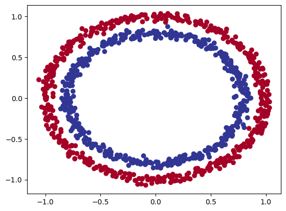

### 2. Linear Regression Dataset

- **Samples**: 100
- **Features**: 1
- **Target**: Linear relationship: y = 0.7x + 0.3
- **Purpose**: Demonstrating model capacity on linear data

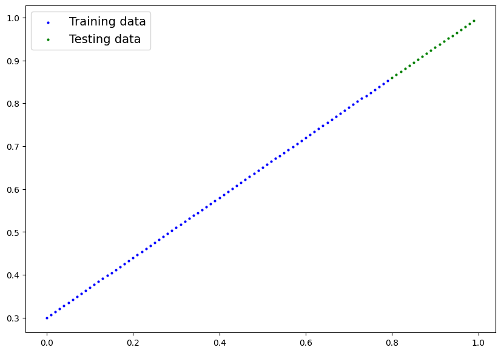

### 3. Blobs Dataset (Multi-class Classification)

- **Samples**: 1000
- **Features**: 2
- **Classes**: 4 distinct clusters
- **Cluster Std**: 1.5
- **Split**: 80% train, 20% test

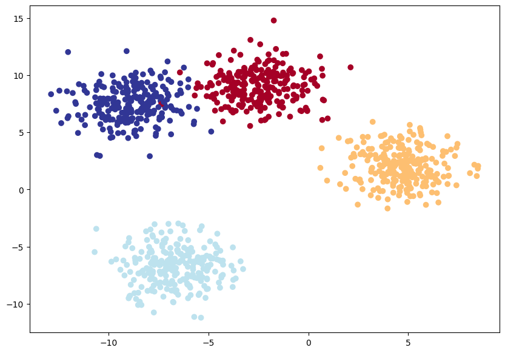

---

## Models & Architectures

### Model 0: Simple Linear Model

- **Purpose**: Baseline binary classifier
- **Architecture**: 2 → 5 → 1
- **Activation**: None (Linear)
- **Loss Function**: BCEWithLogitsLoss
- **Optimizer**: SGD (lr=0.1)
- **Epochs**: 100
- **Accuracy**: 51%

**Code Structure**:

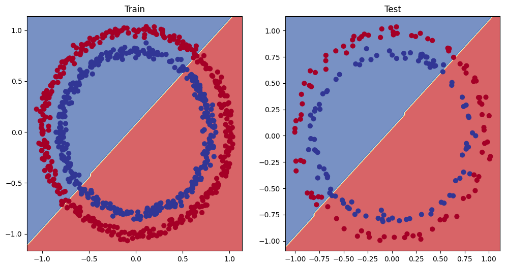

**Finding**: Cannot learn non-linear decision boundaries without activation functions.

---

### Model 1: Deeper Linear Model

- **Purpose**: Test if adding depth helps without activation
- **Architecture**: 2 → 10 → 10 → 1
- **Activation**: None (Linear)
- **Loss Function**: BCEWithLogitsLoss
- **Optimizer**: SGD (lr=0.1)
- **Epochs**: 1000
- **Accuracy**: 46%

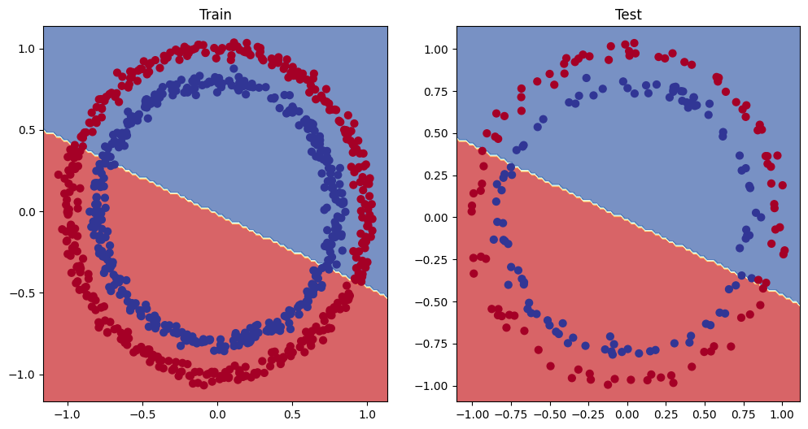

**Finding**: Depth alone doesn't solve non-linear problems.

---

### Model 2: Regression Model

- **Purpose**: Linear regression on synthetic data
- **Architecture**: 1 → 10 → 10 → 1
- **Activation**: None (Linear)
- **Loss Function**: L1Loss (Mean Absolute Error)
- **Optimizer**: SGD (lr=0.01)
- **Epochs**: 1000
- **Performance**: MAE = 0.003

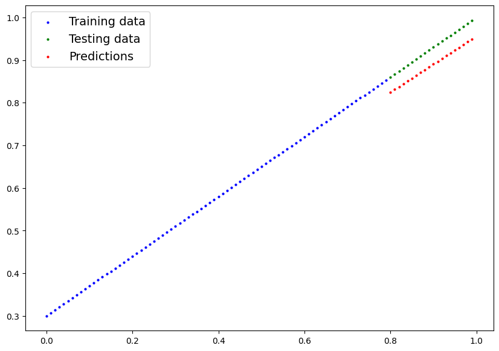

**Finding**: Linear model successfully fits to linear data (y = 0.7x + 0.3).

---

### Model 3: Non-Linear Circles Classifier **BEST**

- **Purpose**: Binary classification with non-linearity
- **Architecture**: 2 → 10 → 10 → 1
- **Activation**: **ReLU**
- **Loss Function**: BCEWithLogitsLoss
- **Optimizer**: SGD (lr=0.1)
- **Epochs**: 1000
- **Accuracy**: **79%**

**Key Finding**: ReLU activation enables learning curved decision boundaries!

---

### Model 4: Multi-class Classifier

- **Purpose**: 4-class blob classification
- **Architecture**: 2 → 8 → 8 → 4
- **Activation**: ReLU
- **Loss Function**: CrossEntropyLoss
- **Optimizer**: SGD (lr=0.1)
- **Epochs**: 100
- **Accuracy**: 99.5%

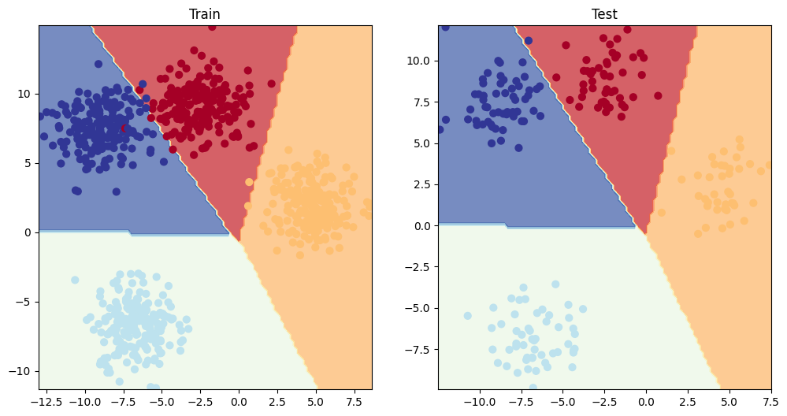

**Finding**: Successfully classifies 4 distinct clusters with ReLU activation.

---

## Experimental Results

### Results Comparison Table

| Model       | Task                | Architecture | Activation | Loss Function   | Epochs | Train          | Test           | Key Finding                              |
| ----------- | ------------------- | ------------ | ---------- | --------------- | ------ | -------------- | -------------- | ---------------------------------------- |
| **Model 0** | Binary (Circles)    | 2→5→1        | Linear     | BCE with Logits | 100    | 49.12% Acc     | 51% Acc        | Linear model fails on non-linear data    |
| **Model 1** | Binary (Circles)    | 2→10→10→1    | Linear     | BCE with Logits | 1000   | 51% Acc        | 46% Acc        | Depth without activation helps minimally |
| **Model 2** | Regression          | 1→10→10→1    | Linear     | L1 Loss         | 1000   | 0.01 MAE       | 0.003 MAE      | Successfully fitted linear relationship  |
| **Model 3** | Binary (Circles)    | 2→10→10→1    | **ReLU**   | BCE with Logits | 1000   | **74% Acc**    | **79% Acc**    | **ReLU is transformative!**              |
| **Model 4** | Multi-class (Blobs) | 2→8→8→4      | **ReLU**   | CrossEntropy    | 100    | **99.12% Acc** | **99.50% Acc** | Successful 4-class classification        |

### Performance Analysis

#### Binary Classification (Circles Dataset)

- **Without Non-linearity (Models 0-1)**: Plateaus at 46-52% accuracy
- **With ReLU (Model 3)**: Achieves 74-79% accuracy

#### Multi-class Classification (Blobs Dataset)

- **Architecture Impact**: 2 hidden layers with 8 units each sufficient
- **Final Performance**: 99.5% test accuracy
- **Epochs Needed**: 100 epochs achieves convergence with ReLU

#### Regression Task

- **Mean Absolute Error**: 0.003 on test sets
- **Observation**: Linear model succeeds on linear data

---

## Key Findings

### 1. **Non-linearity is Essential**

Linear models fail to classify non-linearly separable data. Without activation functions, deeper networks don't significantly improve performance.

**Evidence**: Models 0 and 1 both plateau at 46-52% on the circles dataset.

### 2. **ReLU Activation is Transformative**

Adding ReLU activation functions enables models to learn curved decision boundaries.

**Evidence**: Model 3 jumps from 51% to 79% accuracy simply by adding ReLU.

### 3. **Model Architecture Matters**

- More hidden units → better representation capacity
- Multiple hidden layers → can learn hierarchical features
- **But**: Without activation functions, architecture improvements are limited

### 4. **Loss Function Selection**

- **BCEWithLogitsLoss**: Combines sigmoid + binary cross-entropy (numerically stable)
- **CrossEntropyLoss**: Ideal for multi-class problems
- **L1Loss**: Good for regression tasks (Mean Absolute Error)

---

## Activation Functions

### ReLU (Rectified Linear Unit)

```
ReLU(x) = max(0, x)
```

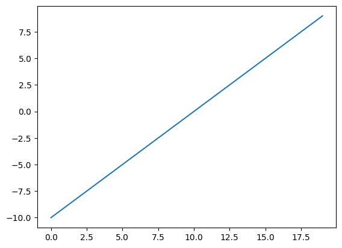


### Sigmoid

```
Sigmoid(x) = 1 / (1 + e^(-x))
```

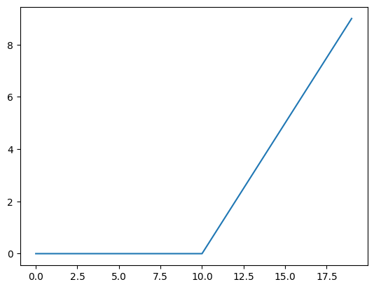
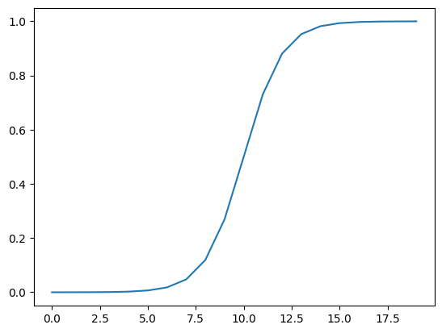

---

## Decision Boundary Comparison

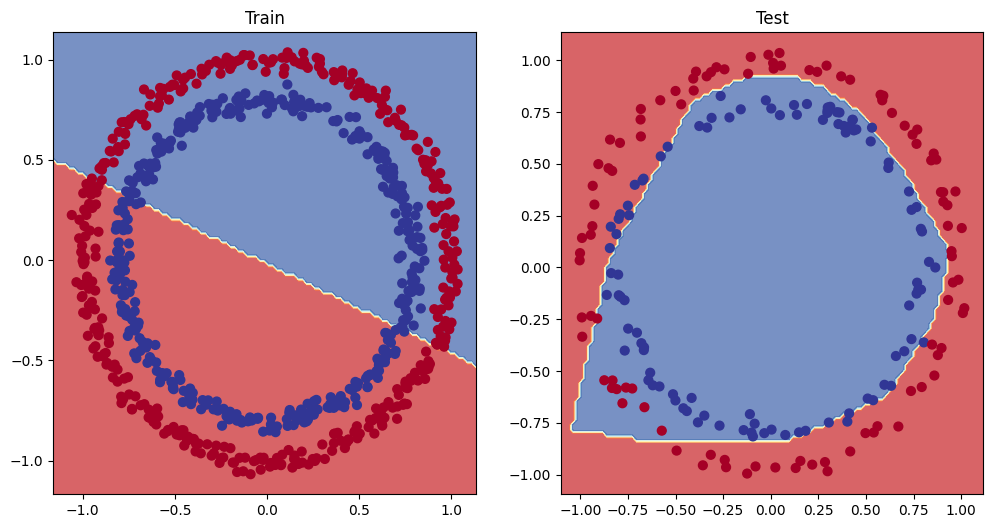

**Visualization Comparison**:

- **Linear Model (Model 0)**: Produces straight-line decision boundary
- **Non-linear Model (Model 3)**: Produces curved decision boundary
- **Conclusion**: ReLU enables the model to separate non-linear patterns

---

## Requirements

```
torch>=1.9.0
numpy>=1.19.0
scikit-learn>=0.24.0
matplotlib>=3.3.0
pandas>=1.1.0
requests>=2.25.0
```

---

## Installation & Usage

### Step 1: Clone the repository

```bash
git clone <repository-url>
cd neural-network-classification-pytorch
```

### Step 2: Create virtual environment

```bash
# Using venv
python -m venv venv
source venv/bin/activate  # On Windows: venv\Scripts\activate

# Or using conda
conda create -n pytorch-nn python=3.9
conda activate pytorch-nn
```

### Step 3: Install dependencies

```bash
pip install -r requirements.txt
```

### Step 4: Run the notebook

```bash
# Jupyter Notebook
jupyter notebook neural-network-classification-pytorch.ipynb

# Or Jupyter Lab
jupyter lab neural-network-classification-pytorch.ipynb
```

---

---

## Learning Path

Follow this sequence to understand the project:

1. **Understand the Data** → Section 1 of notebook (dataset creation and visualization)
2. **Learn Model Basics** → Section 2 (Model 0 introduction)
3. **Discover Linear Limitations** → Sections 3-4 (Models 0-1 fail on non-linear data)
4. **Introduce Non-linearity** → Section 6 (Model 3 with ReLU succeeds)
5. **Extend to Multi-class** → Section 8 (Model 4)
6. **Explore Activation Functions** → Section 7 (ReLU & Sigmoid visualization)

---

## License

MIT License - Free for educational purposes

---

## Author

- **Developed by:** Omar Hafez Khalil
- **GitHub:** [OmarHKhalil](https://github.com/OmarHKhalil)
- **LinkedIn:** [Omar Khalil](https://www.linkedin.com/in/omar-khalil-55a674281)
