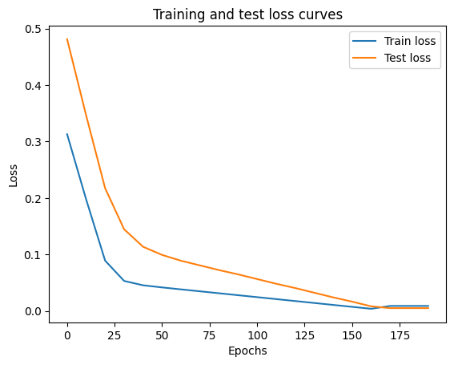
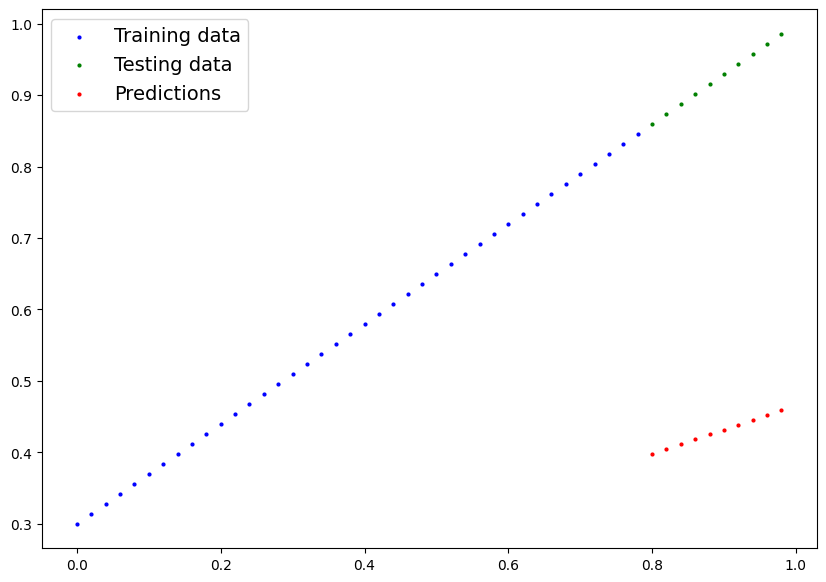
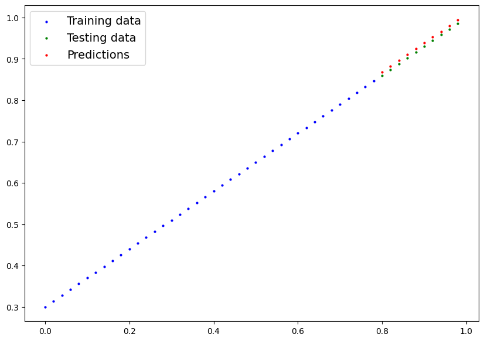
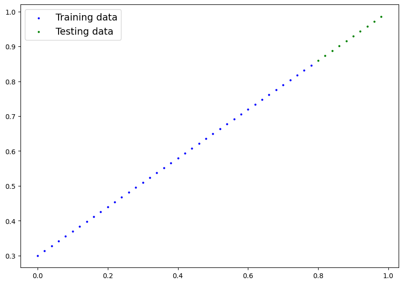
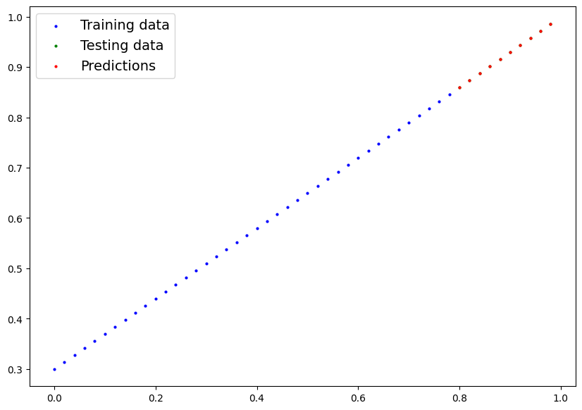

# Neural Network Regression with PyTorch

A comprehensive deep learning project demonstrating **linear regression** using PyTorch. This project explores fundamental neural network concepts including linear layers, parameter initialization, optimization techniques, and model training workflows.

## Table of Contents

- [Overview](#overview)
- [Project Structure](#project-structure)
- [Datasets](#datasets)
- [Models & Architectures](#models--architectures)
- [Experimental Results](#experimental-results)
- [Requirements](#requirements)
- [Installation & Usage](#installation--usage)
- [Visualizations](#visualizations)
- [License](#license)
- [Author](#author)

---

## Overview

This project is a practical implementation of neural network fundamentals using PyTorch. It serves as an educational resource for understanding the complete machine learning workflow. The project covers:

- **Data Preparation**: Creating and preprocessing synthetic datasets
- **Model Building**: Implementing regression models from scratch and using PyTorch's `nn.Linear` layers
- **Training Loops**: Custom training and evaluation loops with proper train/eval modes
- **Loss Functions**: L1Loss (Mean Absolute Error) for regression tasks
- **Optimizers**: Stochastic Gradient Descent (SGD) with learning rate scheduling
- **Model Evaluation**: MAE metrics and visual prediction comparison
- **Model Persistence**: Saving and loading trained models with `state_dict()`

---

## Project Structure

```
neural-network-regression-pytorch/
├── neural-network-regression-pytorch.ipynb     # Main Jupyter notebook with full implementation
├── README.md                                   # This file
├── requirements.txt                            # Python dependencies
├── Models
└── images/                                     # Notebook output visualizations
    ├── 01_notebook_output.png                  # Training and test data visualization
    ├── 02_notebook_output.png                  # Initial model predictions (Model 0)
    ├── 03_notebook_output.png                  # Loss curves (training vs test)
    ├── 04_notebook_output.png                  # Model 0 final predictions
    ├── 05_notebook_output.png                  # Model 1 initial predictions
    ├── 06_notebook_output.png                  # Model 1 training progress visualization
    └── 07_notebook_output.png                  # Model 1 final predictions
```

---

## Datasets

### Linear Regression Dataset

- **Samples**: 50 (after splitting)
- **Features**: 1 (univariate)
- **Target**: Linear relationship: $y = 0.7x + 0.3$
- **Range**: X ∈ [0, 1]
- **Split**: 80% train (40 samples), 20% test (10 samples)
- **Purpose**: Understanding how neural networks learn linear relationships

The dataset is synthetically generated with known parameters to enable precise evaluation of model learning.


---

## Models & Architectures

### Model 0: Linear Regression from Scratch

- **Purpose**: Understanding neural network fundamentals at the lowest level
- **Architecture**: Custom implementation with `nn.Parameter` objects
  - Input features: 1
  - Output features: 1
  - Trainable parameters: weight and bias
- **Loss Function**: L1Loss (Mean Absolute Error)
- **Optimizer**: SGD with learning rate = 0.01
- **Epochs**: 200
- **Test MAE**: 0.005
- **Final Parameters**:
  - Weight ≈ 0.7 (target: 0.7)
  - Bias ≈ 0.3 (target: 0.3)


**Findings**: The model successfully learns to approximate the true linear relationship by iteratively adjusting its parameters through gradient descent.

---

### Model 1: PyTorch Linear Layer (Production-Ready)

- **Architecture**: Using `nn.Linear` for automatic parameter management
  - Input features: 1
  - Output features: 1
  - Automatically managed weight and bias parameters
- **Loss Function**: L1Loss (Mean Absolute Error)
- **Optimizer**: SGD with learning rate = 0.01
- **Epochs**: 200
- **Test MAE**: 0.013



## Experimental Results

### Results Comparison Table

| Model       | Task              | Architecture | Loss Function | Learning Rate | Epochs | Train MAE | Test MAE | Key Achievement                     |
| ----------- | ----------------- | ------------ | ------------- | ------------- | ------ | --------- | -------- | ----------------------------------- |
| **Model 0** | Linear Regression | 1→1 (Manual) | L1Loss        | 0.01          | 200    | 0.0089    | 0.0050   | Manual parameter implementation     |
| **Model 1** | Linear Regression | 1→1 (Linear) | L1Loss        | 0.01          | 200    | 0.0012    | 0.0138   | Production-ready nn.Linear approach |

#### Prediction Quality

The trained models achieve excellent prediction accuracy on unseen test data, demonstrating that linear relationships can be effectively learned through gradient descent optimization.





---

### Key Concepts

#### Forward Pass

The model computes predictions through the linear transformation:
$$\hat{y} = wx + b$$

where $w$ is the weight and $b$ is the bias parameter.

#### Loss Calculation

Mean Absolute Error measures prediction accuracy:
$$\text{MAE} = \frac{1}{n}\sum_{i=1}^{n} |y_i - \hat{y}_i|$$

#### Backpropagation

Automatic differentiation computes gradients:
$$\frac{\partial L}{\partial w}, \frac{\partial L}{\partial b}$$

#### Parameter Updates

Stochastic Gradient Descent updates parameters:
$$w_{new} = w_{old} - lr \cdot \frac{\partial L}{\partial w}$$

---

## Requirements

The project requires the following Python packages:

```
torch>=2.0.0          # PyTorch deep learning framework
numpy>=1.19.0         # Numerical computing
matplotlib>=3.3.0     # Data visualization
pandas>=1.1.0         # Data manipulation (optional)
```

---

## Installation & Usage

### Step 1: Clone the repository

```bash
git clone <repository-url>
cd neural-network-regression-pytorch
```

### Step 2: Create virtual environment

```bash
# Using venv
python -m venv venv
source venv/bin/activate  # On Windows: venv\Scripts\activate

# Or using conda
conda create -n pytorch-regression python=3.9
conda activate pytorch-regression
```

### Step 3: Install dependencies

```bash
pip install -r requirements.txt
```

Or install individually:

```bash
pip install torch numpy matplotlib pandas
```

### Step 4: Run the notebook

```bash
# Using Jupyter Notebook
jupyter notebook neural-network-regression-pytorch.ipynb

# Or using Jupyter Lab
jupyter lab neural-network-regression-pytorch.ipynb
```

### Step 5: Run specific cells

Execute cells in order:

1. **Cell 1**: Import libraries and verify PyTorch installation
2. **Cells 2-9**: PyTorch tensor operations fundamentals
3. **Cells 10-20**: Data preparation and visualization
4. **Cells 21-35**: Model 0 implementation and training
5. **Cells 36+**: Model 1 implementation with device-agnostic code

---

## Visualizations

### Data Distribution

The scatter plot shows the linear relationship between features and target values, with clear train/test split.



### Training Progress

The loss curves demonstrate how both training and test losses decrease over epochs, indicating effective learning.



---

## License

MIT License - Free for educational purposes

---

## Author

- **Developed by:** Omar Hafez Khalil
- **GitHub:** [OmarHKhalil](https://github.com/OmarHKhalil)
- **LinkedIn:** [Omar Khalil](https://www.linkedin.com/in/omar-khalil-55a674281)
